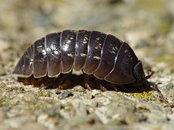
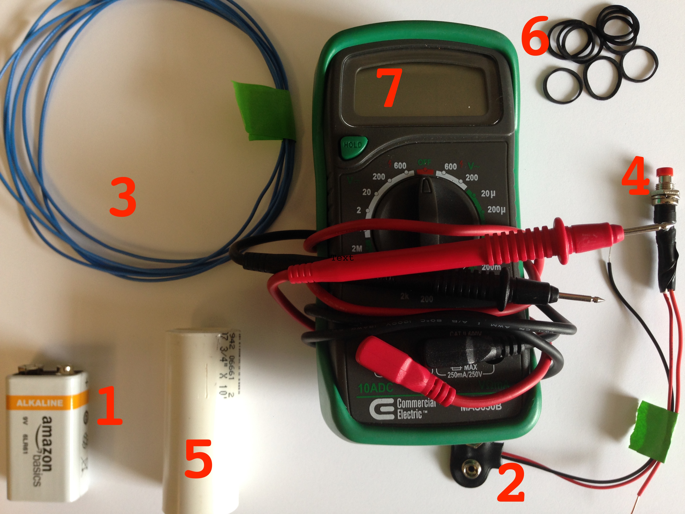
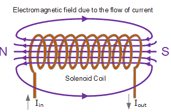
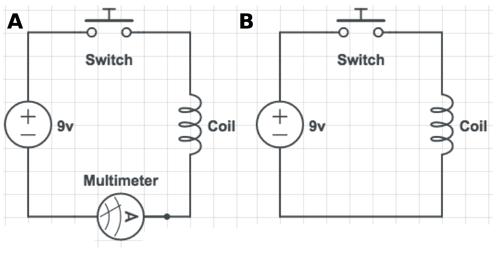

# Lab Experiment: Magnetoreception in pill bugs
In this lab, we are going to test two questions:
1. Do pill bugs move, or orient, in a preferred direction?
2. Does exposure to a pulsed magnetic field change pill bug orientation?
This is a multidiscplinary project, as we will learn concepts in physics, electronics, magnetics, sensory biology, behavior, and mathematics!!!  I hope you enjoy!

## A little background on pill bugs
Pill bugs, also known as sow bugs, potato bugs, or roly polies, are a terrestrial crustacean (yes, similar to lobsters, crabs, and barnacles) of the order Isopoda.  The common pill bug, *Armadillidium vulgare*, can be found throughout Europe and North America, although it has been introduced into North America. They are famous for their abiity to roll into a ball in order to protect themselves.  You can commonly find them underneath loose leaf litter or debris on the ground, often in cool, dark places.  They are absolutely harmless!!!! See the picture of a pill bug below taken from their [Wikipedia page](https://en.wikipedia.org/wiki/Armadillidiidae).

However, it is not known if pill bugs can sense magnetic fields.  If you remember yesterday, we looked at data that demonstrated spiny lobsters change their orientation after exposure to a magnetic pulse, thus suggesting they can sense magnetic fields.  Since pill bugs are also crustaceans, perhaps they too have magnetoreception!  Although today's lab may not provide undisputable results, it is a first step.
## Experiment outline:
1.  Build a pulse-magnetizer
    * measure the magnetic field produced
2.  Examine pill big orientation before exposure to a magnetic field (Control)
    * repeat ≥10 trials
3. Expose pill bugs to a magnetic pulse (Pulsed)
    * repeat ≥10 trials
4. Calculate statistics and compare the Control and Pulsed groups.

## Part 1: Building a pulse-magnetizer
In the spiny lobsert experiment, the authors used a machine called a "pulse magnetizer" to generate a powerful magnetic field for a very brief amount of time.  This same kind of machine is used to magnetize things like screwdrivers, electrical components, or even refrigerator magnets.  The machine generated a magnetic field strength of around 0.085 Tesla.  For comparison, the Earth's magnetic field strength is about 0.00005 Telsa (or 0.5 Gauss), and an MRI machine is around 1.5 Tesla.  Therefore, the spiny lobsters were exposed to a magnetic field ~1700X stronger than normal!.  Now, we don't have access to a fancy pulse magnetizer, so we are going to build one.  It won't be as strong as what was used for lobsters, and our pulse wont be as fast, but it may still produce a measureable effect.  Building one is quite simple, since it is just an electromagnet.  You may remember some of the concepts from physics class, but we will review the concepts along the way.  Put on your engineering caps and let's begin!

Materials required (see numbered picture below):
1. 9 volt battery
2. 9 volt batter connector with wire leads
3. X cm copper wire (18 - 24 gauge)
4. Push button switch (momentary)
5. PVC tube, 6 cm long by 2 cm inside diameter
6. Small rubber bands
7. Multimeter

An electromagnet is just a coil of wire.  When electricity flows through the coil, it produces a magnetic field.  See the diagram below:

As indicated by the diagram, the current (referred to as "I") flows through the coil from left (negative) to right (positive).  The coil creates a magnetic field with the north pole (N) directed to the left. Remember, current is measured in Amperes (amps) and flows from the negative terminal of a battery to the positive side.  We are going to build the coil by wrapping the wire around the PVC pipe.  Follow the steps below:
- Step 1:
  * Place several rubber bands around the PVC pipe, the rubber bands will help to secure the wire.
- Step 2:
  * Pass the wire underneath the rubber band at the bottom, leaving about 10 cm excess.
- Step 3:
  * Wrap the wire tightly around the PVC pipe.  As we will see later, the more dense the could the stronger the magnetic field
- Step 4:
  * Stop wrapping when ~10 cm of wire is remaining. Secure the wire with rubber bands.
  
  Example picture:
  

Next, we are going to wire our pulse magnetizer.  To build the circuit, you will need to connect the 9 volt battery to a switch and to the coil.  The switch and battery connector have already been connected together.  Before we complete out circuit, we will measure the current running through our coil in order to estimate the magnetic field strength.
- Step 1:
  * Connect the negative wire (black) of the battery connector to the bottom lead of the coil (lead nearest the end of the PVC pipe).  Simply twist the expose wires together then cover with electrical tape.
-Step 2:
  * To measure the current, touch the black electrode to the other lead of the coil and the red electrode to the red cable coming from the switch.  

Build the circuit as shown in the diagram below.  To avoid any potential short circuits, connect the battery last.  Remember, the circuit will not be complete

