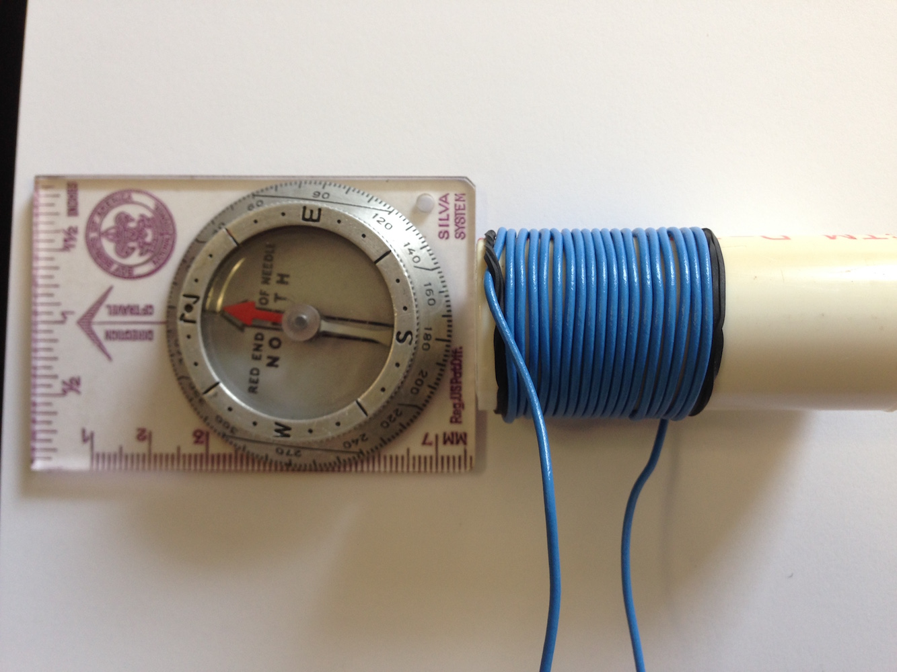

# Lab Experiment: Magnetoreception in pill bugs
In this lab, we are going to test two questions:
1. Do pill bugs move, or orient, in a preferred direction?
2. Does exposure to a pulsed magnetic field change pill bug orientation?
This is a multidiscplinary project, as we will learn concepts in physics, electronics, magnetics, sensory biology, behavior, and mathematics!!!  I hope you enjoy!

## A little background on pill bugs
Pill bugs, also known as sow bugs, potato bugs, or roly polies, are a terrestrial crustacean (yes, similar to lobsters, crabs, and barnacles) of the order Isopoda.  The common pill bug, *Armadillidium vulgare*, can be found throughout Europe and North America, although it has been introduced into North America. They are famous for their abiity to roll into a ball in order to protect themselves.  You can commonly find them underneath loose leaf litter or debris on the ground, often in cool, dark places.  They are absolutely harmless!!!! See the picture of a pill bug below taken from their [Wikipedia page](https://en.wikipedia.org/wiki/Armadillidiidae).

However, it is not known if pill bugs can sense magnetic fields.  If you refer to the [Circular data analysis tutorial](./Circular_data_exercise.md), we looked at data that demonstrated spiny lobsters change their orientation after exposure to a magnetic pulse, thus suggesting they can sense magnetic fields.  Since pill bugs are also crustaceans, perhaps they too have magnetoreception!  Although today's lab may not provide undisputable results, it is a first step.
## Experiment outline:
1.  Build a pulse-magnetizer
    * measure the magnetic field produced
2.  Examine pill big orientation before exposure to a magnetic field (Control)
    * repeat ≥10 trials
3. Expose pill bugs to a magnetic pulse (Pulsed)
    * repeat ≥10 trials
4. Calculate statistics and compare the Control and Pulsed groups.

## Part 1: Building a pulse-magnetizer
In the spiny lobsert experiment, the authors used a machine called a "pulse magnetizer" to generate a powerful magnetic field for a very brief amount of time.  This same kind of machine is used to magnetize things like screwdrivers, electrical components, or even refrigerator magnets.  The machine generated a magnetic field strength of around 0.085 Tesla.  For comparison, the Earth's magnetic field strength is about 0.00005 Telsa (or 0.5 Gauss), and an MRI machine is around 1.5 Tesla.  Therefore, the spiny lobsters were exposed to a magnetic field ~1700X stronger than normal!.  Now, we don't have access to a fancy pulse magnetizer, so we are going to build one.  It won't be as strong as what was used for lobsters, and our pulse wont be as fast, but it may still produce a measureable effect.  Building one is quite simple, since it is just an electromagnet.  You may remember some of the concepts from physics class, but we will review the concepts along the way.  Put on your engineering caps and let's begin!

Materials required (see numbered picture below):
1. 9 volt battery
2. 9 volt batter connector with wire leads
3. 2 m copper wire (18 - 24 gauge)
4. Push button switch (momentary)
5. PVC tube, 6 cm long by 2 cm inside diameter
6. Small rubber bands
7. Multimeter

An electromagnet is just a coil of wire.  When electricity flows through the coil, it produces a magnetic field.  See the diagram below:

As indicated by the diagram, the current (referred to as "I") flows through the coil from left (negative) to right (positive).  The coil creates a magnetic field with the north pole (N) directed to the left. Remember, current is measured in Amperes (amps) and flows from the negative terminal of a battery to the positive side.  We are going to build the coil by wrapping the wire around the PVC pipe.  Follow the steps below:
- Step 1:
  * Place several rubber bands around the PVC pipe, the rubber bands will help to secure the wire.
- Step 2:
  * Pass the wire underneath the rubber band at the bottom, leaving about 10 cm excess.
- Step 3:
  * Wrap the wire tightly around the PVC pipe.  As we will see later, the more dense the could the stronger the magnetic field
- Step 4:
  * Stop wrapping when ~10 cm of wire is remaining. Secure the wire with rubber bands.
  
  Example picture:
  

Next, we are going to wire our pulse magnetizer.  To build the circuit, you will need to connect the 9 volt battery to a switch and to the coil.  The switch and battery connector have already been connected together.  Before we complete out circuit, we will measure the current running through our coil in order to estimate the magnetic field strength.  Part A of the figure below shows the circuit with the multimeter attached, and part B shows the final circuit.

- Step 1:
  * Connect the negative wire (black) of the battery connector to the bottom lead of the coil (lead nearest the end of the PVC pipe).
  * Simply twist the expose wires together then cover with electrical tape.
- Step 2:
  * To measure the current, touch the black electrode to the other lead of the coil and the red electrode to the red cable coming from the switch.
  * Alligator clips are available at my desk if needed to make this easier.
  * Turn the multimeter setting to the 10A setting.
  * With your partner, one person should press the switch and hold it on for 2-3 seconds while the other partner records the maximum value on the screen.
  * Repeat 3 times and take the average.  This is the current, in amps, flowing through the circuit.
- Step 3:
  * Disconnect the multimeter, and connect the remaining two wires together.  Remember to seal the connection with electrical tape.
- Step 4:
  * Calculate the magnetic field strength.  To do so, we use the equation:

## B = u * n * I

B = magnetic field strength in Tesla

u = permeability constant, for air u = 12.6 x 10e-7 T/amp m

n = number of wire turns per meter

I = current in Amperes

- Step 5:
  * Check the direction of the field.  First, align a compass with magnetic north on your desk.
  * Lay your coil on its side, with the bottom opening in line with the south compass point. (see image below)
  * Press the switch for 2-3 seconds.  If the compass needle flips around, then label this end of the coil as south ("S").  This is because the tip of the compass needle that points north is called "north seeking", and points away from the south end of a magnet.
  * If the compass needle didn't flip around, rotate your coil 180 degress (try the other end) and repeat the above step.  Make sure to corectly label the N and S ends of your coil!

- Step 5:
  * OPTIONAL: if you have time and are interested, download a magnetometer app for your phone, e.g. Magnitude.  Open the app, and place it next to your coil.  Record the field strength parameters.  Now, turn your coil on (press the switch) for 1-2 seconds.  Record the reading with the coil turned on.  How much did the field change?  Is this similar or different that what you predicted from the equation?  If different, what reasons may account for this? Make sure to check your units, you can use Google to convert units!

## Part 2: Orientation experiment (Control)
Great job building your pulse magnetizer!  However, before we use it, we need to establish a baseline for pill bug orientation.  This will be the control group.  The process is pretty easy.  In order to get a good estimate, the control experiment should be repeated at least 10 times.
Materials required:
1.  Pill bug (so cute!!!)
2.  Plastic tube with cap that fits inside the PVC pipe
3.  Compass
4.  Orientation arena (paper with a circle and angles printed)
5.  Stopwatch (your phone usually has one)
6.  OPTIONAL: protractor

- Step 1:
  * Using your compass, align your arena so the "0" degree mark is positioned with magnetic north.  Use some tape to secure your arena to the desk.
- Step 2:
  *  Place the pill bug in the center of the arena.
- Step 3:
  *  Invert the tube cap and cover the pill bug so it is in darkness
- Step 4:
  *  Allow the pill bug to rest for 1-2 minutes
- Step 5:
  *  Release the pill bug (pick up the cap) and start the stopwatch
- Step 6:
  *  Mark the point where the pill bug crosses the circle edge.  If the pill bug does not reach the edge within 30 seconds, restart the trial.
  * Record the angle of the mark.  OPTIONAL: use a protractor to get more accurate measurements
- Step 7:
  * Repeat the trial at least 10 times.

## Part 3: Orientation experiment (Pulsed)
This set of trials with be performed identical to the control set, with the exception of an added step that exposes the pill bug to a magnetic pulse.
- Step 1:
  * Set up your pulse magnetizer so the PVC pipe is standing vertically. The direction of the magnetic field should be pointing upright.
- Step 2:
  * Place the pill bug inside the plastic tube and insert the tube inside the pulse magnetizer (PVC pipe)
- Step 3:
  * Activate (turn on) the pulse-magnetizer for 2 seconds.
- Step 4:
  * Repeat steps 2-7 from the previous Control experiment.  Make sure to perform at least 10 trials.

## Part 4:  Calculate statistics
Using what you learned yesterday regarding circular statistics, calculate the following statistics:
1.  Mean angle in Control group
2.  Rayleigh test result for Control group
3.  Mean angle in Pulsed group
4.  Rayleigh test result for Pulsed group
5.  Compare the two groups using the Watson test

# Lab Report Assignment!!!!
Your assignment is a short and simple lab report.  It shouldn't be more than 1 page, including figures or tables.  Please address the following items:
1.  Provide a plot of the control and pulsed groups (can be together or separate plots)
2.  Summarize the data, including the estimate of the magnetic pulse strength and results of the statistical tests.
3.  Discuss the following items:
  * Whether or not your results support an effect of the magnetic pulse on pill bug orientation.
  * What other factors may have contributed to the pill bug orientation?
  * How would you improve this experiment in the future?
  
## Please dissamble your pulse magnetizers when finished and return them to the instructor when finished.

