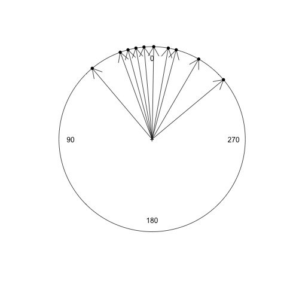
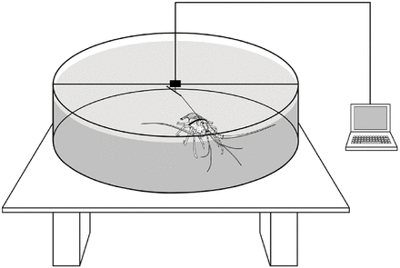

# Circular Data in Biology
This page is a tutorial to learn about and practice the statistical analysis of circular (orientation) data in biology.  Circular statistics are often employed to analyze various types of biologic data that is described, for example, by angles (directions) or periodic processes (eg., circadian rhythyms or lunar cycles).  This tutorial is designed for use in R, which has already been introduced into this class.

Before we begin, and in case you have not used GitHub before, GitHub is a useful resource for designing and sharing comuter code, tutorials, and data with others.  Below, will be various text describing the steps to be performed.  Additionally, you will encounter gray boxes.  These gray boxes contain the actual code that can be used in R.  Lines of code that are ignored by R begin with an hashtag (#), and the other lines contain the commands.  For example:
```R
# Make a vector
data = c(1, 2, 3, 5:11)

# Calculate the mean
mean(data)
```
The commands in the gray box above can be directly copied and pasted into an R terminal, or typed by hand.  Additionally, you may find links to datasets or websites underlined in blue.  For example, you can find more information on circular statistics at [this wikipedia page](https://en.wikipedia.org/wiki/Directional_statistics). If you have any additional questions about GitHub or this tutorial, please let me know during the exercise.  Have fun!

## Part 1:  Circular Mean
In order to make some specialized commands available to us to analyze circular data, we are going to install a 'package'.  The package is called ['circular'](https://cran.r-project.org/web/packages/circular/index.html), and its manual is available [here](https://cran.r-project.org/web/packages/circular/circular.pdf).

First, open your R terminal (or R studio), and enter the following commands:
```R
# Install R package
install.packages('circular')

# Load the package
library(circular)
```
Assuming you did not receive any error messages, you are now ready to begin analyzing circular data.
As mentioned in the lecture, we have to treat data on the circle a bit differently than you may be used to.
Let's start with some practice data. All numbers are angles, which range between 0 and 360 degrees.
```R
# Make some practice data
data = c(5, 350, 330, 40, 20, 345, 359, 10, 15, 310)

# Calculate the mean
mean(data)
```
The mean (average) calculated above is the arithmetic mean.  Now, on a scrap piece of paper, draw a circle, put 0 degrees at the top, then draw a line for each of the 10 observations.  It should look something like this:


Now, draw a new line for the arithmetic mean angle calculated above.  What do you notice about the mean?  Does this appear to be correct?

Next, we are going to calculate the circular mean, or sometimes called the 'mean angle' or 'preferred direction'.  To do so, we have to specifically tell R that our data are angles.
```R
# Convert our data to angle (circular) format
data.circular = circular(data, units = "degrees", template = "geographics")

# Calculate the mean
mean(data.circular)
```
Notes about the above command:
- 'circular' is a function to convert our data
- 'units = "degrees"' sets the units to degrees rather than radians (remember geometry class?)
- 'template = "geographics"' sets the zero at the top, and clockwise direction.

Draw this new mean angle on your circle. How does this mean angle compare with the one you calculated previously? Is this a better choice for the mean?  The mean angle may be negative... if so, can you convert it to be in the range 0 - 360 degrees?  What does the sign (postive or negative) indicate?

## Part 2:  Plotting
In this section, we are going to practice plotting circular data for visualization.  However, saving the plots as pictures, like a .jpg or .png file, is different for PC vs Mac.  Let me know if you have trouble saving a plot.
```R
# Plot our circular data
plot(data.circular)
```
You should have a circular plot, with each data point plotted on the edge of the circle.  Let's repeat the plotting again, but this time change the color:
```R
# Plot our circular data in blue
plot(data.circular, col = "blue")
```
Great job!  You are now coding in R!!!
Next, let's add arrows
```R
# Add arrows for each point
arrows.circular(data.circular, col = "red")

# Repeat the plot as before, but green lines instead of red arrows
plot(data.circular, col = "blue")
arrows.circular(data.circular, col = "green", length = 0)
```
To save your plot, you can try this:
```R
dev.copy(png, file = "circle1.png")
dev.off()
```
The above command should save the plot as a png file called 'circle1.png' in your default folder.
For the last step, let's plot our data as just black points, then the mean angle as a red arrow, and save the result:
```R
plot(data.circular)
arrows.circular(mean(data.circular), col = "red")
dev.copy(png, file = "circle2.png")
dev.off()
```
## Part 3:  Statistical testing
Now the fun begins!  In this last section, we want to perform two statistical tests.  These tests will be practice for our lab experiment tomorrow.
- First, we want to know whether or not a set of points on the circle is different from random.  We will use a test called the 'Rayleigh test'
- Second, we want to know if two groups are the same or different.  For example, we could compare if males and females want to move in the same direction or not.  For comparing two groups, we will use the 'Watson-Wheeler test'.  This test is conceptually similar to a T-test, in case you have performed one in the past.

For both tests, a p-value less than 0.05 suggests:
- for the Rayleigh test, the individuals move in a preferred direction and not at random
- for the Watson-Wheeler test, that the two groups have a different preferred direction.

For our practice data, we will use an actual dataset from Ernst & Lohmann. 2017.  Here is the citation and link to his paper:
[Ernst, D. A. and Lohmann, K. J. (2016). Effect of magnetic pulses on Caribbean spiny lobsters: implications for magnetoreception. Journal of Experimental Biology, 219, 1827-1832](http://jeb.biologists.org/content/219/12/1827).  In this study, the authors wanted to know if a magnetic pulse would disrupt the direction that spiny lobsters traveled. The authors recorded and compared the directions traveled by lobsters from two groups:
- Control group (blindfolded)
- Pulse-magnetized group (blindfolded and exposed to a rapid magnetic pulse)
They used an arena setup similar to the sea turtle example from the lecture.  It looked like this: 

Let's load the data into R:
```R
# Load control data then convert to angles
control = c(213.8, 151.3, 195.4, 32.7, 307.7, 93.9, 187.8, 357.5, 217.6, 307, 196.6, 233.6, 97)
control = circular(control, units = "degrees", template = "geographics")

# Load pulsed data then convert to angles
pulsed = c(342.1, 64.6, 53.6, 0.4, 17.4, 350.8, 51.6, 157.6, 191, 118.2, 317.9, 70.1, 55.8, 73.4)
pulsed = circular(pulsed, units = "degrees", template = "geographics")

# Look at the data in each group
control
pulsed
```
Using the R commands we learned previously, what is the mean angle for each group (between 0 and 360 degrees)?  Plot the points.  Do the two groups look similar or different?

In case you are having trouble, you can use the commands below:
```R
# Get the mean angles for each group
mean(control)
mean(pulsed)

# Plot control group (black)
plot.circular(control)
arrows.circular(mean(control))

# Plot pulsed group (red)
plot.circular(pulsed, col = "red")
arrows.circular(mean(pulsed), col = "red")

# OPTIONAL:  Plot both together
plot.circular(control)
arrows.circular(mean(control))
points(pulsed, col = "red")
arrows.circular(mean(pulsed), col = "red")
```
